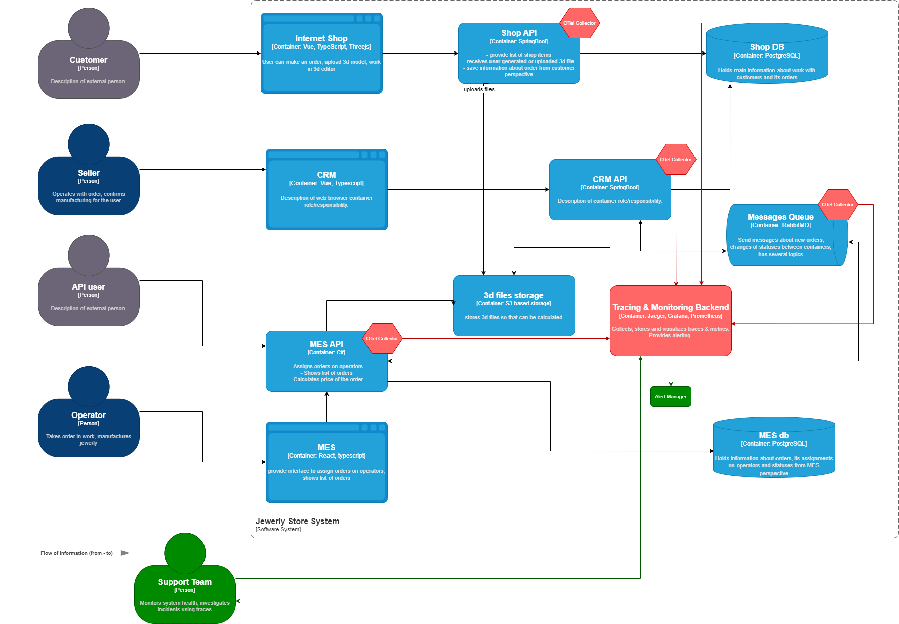

### **Раздел 1: Мотивация**
Внедрение распределенной трассировки (Distributed Tracing) критически необходимо для решения текущих бизнес-проблем компании «Александрит»:
1.  **Прозрачность потока заказа:** Позволит в реальном времени видеть, на каком этапе (и в какой системе) «застревает» каждый заказ, будь то расчет стоимости в MES, подтверждение в CRM или ожидание работы оператора.
2.  **Идентификация узких мест (bottlenecks):** Покажет, какие сервисы (например, MES API, очередь сообщений) являются самыми медленными и вызывают каскадные задержки, что объясняет жалобы на долгую загрузку дашборда и просроченные заказы.
3.  **Ускорение расследования инцидентов:** Вместо ручного анализа логов нескольких систем, поддержка сможет по ID заказа мгновенно восстановить всю историю его обработки, сократив время на диагностику с часов до минут.
4.  **Обоснование для масштабирования:** Данные трассировки предоставят количественные метрики (латентность, нагрузка) для обоснованного принятия решений о горизонтальном масштабировании сервисов (например, MES API) или оптимизации кода/запросов.

**Технические и бизнес-метрики, на которые повлияет трейсинг:**
1.  **Среднее время выполнения заказа (Order Lead Time):** Ключевая бизнес-метрика. Трейсинг покажет, какие стадии вносят наибольший вклад в общее время.
2.  **Время отклика API (API Latency):** Позволит измерить и гарантировать SLA для внешних партнеров, использующих MES API.
3.  **Процент «зависших» заказов:** Количество заказов, которые не переходят из статуса `SUBMITTED` в `PRICE_CALCULATED` или `MANUFACTURING_APPROVED` сверх нормативного времени.
4.  **Эффективность очереди сообщений:** Задержки в обработке сообщений в RabbitMQ между CRM и MES, которые могут приводить к рассинхронизации статусов.
5.  **Удовлетворенность операторов (как косвенная метрика):** Снижение времени загрузки дашборда MES благодаря идентификации и оптимизации медленных запросов к БД.

---

### **Раздел 2: Предлагаемое решение**

**1. Системы для покрытия трассировкой:**
Все ключевые сервисы, участвующие в жизненном цикле заказа:
*   **Internet Shop (Frontend):** Трассировка отправки заказа и загрузки файла.
*   **Shop API (Backend):** Трассировка создания заказа, сохранения файла в S3, отправки сообщения в очередь, сохранение данных в базу.
*   **MES API:** **Критически важный компонент.** Трассировка входящих запросов на расчет стоимости, вызовов к БД MES и очереди сообщений.
*   **CRM API:** Трассировка обработки входящих сообщений из очереди, обновления статусов заказа, работы с Shop DB.

**2. Места, где заказ может «сломаться» или зависнуть (на основе статусов):**
*   **`SUBMITTED` -> `PRICE_CALCULATED`:** Зависание в очереди RabbitMQ или долгий расчет стоимости в MES API (30 минут для сложных моделей).
*   **`PRICE_CALCULATED` -> `MANUFACTURING_APPROVED`:** Потеря сообщения в очереди, сбой или высокая нагрузка CRM API.
*   **`MANUFACTURING_APPROVED` -> `MANUFACTURING_STARTED`:** Проблема с отображением заказа оператору (медленные запросы к MES DB), из-за чего он не видит новый заказ.
*   **Любой этап:** Проблемы с доступностью **3d files storage (S3)** (задержки на скачивание файла для расчета или производства).

**3. Данные для трассировки (Spans):**
Для каждого этапа (span) необходимо записывать:
*   **Trace ID:** Глобальный уникальный идентификатор цепочки (назначается при создании заказа).
*   **Order ID:** Бизнес-идентификатор заказа.
*   **Span ID и Parent Span ID:** Для построения иерархии.
*   **Название операции:** Например, `ShopAPI:CreateOrder`, `MES_API:CalculatePrice`, `RabbitMQ:PublishToCRM`.
*   **Сервис и компонент:** Имя сервиса (shop-api), хост.
*   **Временные метки:** Начало и окончание операции.
*   **Статус выполнения:** Успех/ошибка.
*   **Ключевые теги (Tags):** Статус заказа, ID пользователя, ID файла, ID оператора, количество полигонов в модели (для анализа длительности расчета).
*   **Логи ошибок (при наличии):** Прикрепляются к соответствующему спану.

**4. Архитектура решения:**
*   **Инструмент:** **Jaeger** или **Tempo** (как часть стека Grafana). Выбор за Jaeger из-за зрелости и простоты интеграции с существующим стеком (Spring Boot, .NET).
*   **Сбор трасс:** Внедрение клиентских библиотек (инструментация) в код Shop API (Spring Boot Sleuth), MES API (OpenTelemetry для .NET), CRM API (Spring Boot Sleuth).
*   **Агенты:** Развертывание агентов OpenTelemetry Collector на каждой виртуальной машине (EC2) для сбора трасс от инструментированных приложений их буферизации и отправки в бэкенд.
*   **Хранилище и UI:** Развертывание кластера Jaeger (сборщик, запросчик, база данных - например, Elasticsearch) в отдельном VPC для хранения трасс и предоставления веб-интерфейса для поиска и визуализации.
*   **Мониторинг и алертинг на основе трасс (зеленые компоненты):**
    *   **Grafana + Prometheus:** Настроить сбор агрегированных метрик из трассировочных данных (например, гистограммы длительности операций, счетчики ошибок) через метрики Jaeger или напрямую из OTel Collector.
    *   **Дашборды:** Создать в Grafana дашборды для мониторинга ключевых метрик: "Время расчета стоимости заказа", "Задержка в очереди CRM", "Количество активных трасс по статусу заказа".
    *   **Alerting:** Настроить в Prometheus/Grafana алерты на основе этих метрик. Например: "Если >5% заказов находятся в статусе `SUBMITTED` более 10 минут" или "P95 времени ответа MES API > 15 минут".

---

### **Раздел 3: Компромиссы**
1.  **Проприетарный софт MES:** Исходный код MES куплен, но инструментировать его может быть сложно или дорого, если он написан на устаревшем стеке или имеет монолитную архитектуру без поддержки middleware для трейсинга. **Компромисс:** Начать с трассировки на границах системы (в MES API и вокруг очередей), чтобы видеть вход/выход, даже без деталей внутри самого MES.
2.  **Производительность:** Внедрение трейсинга добавляет overhead (нагрузку) на каждое приложение (1-5%). Для высоконагруженного MES API это может быть чувствительно. **Компромисс:** Использовать выборочный (sampled) сбор трасс (например, 10% запросов), особенно для самых "шумных" операций, увеличивая sampling rate для запросов с ошибками.
3.  **Объем данных и стоимость хранения:** Полный сбор всех трасс для тысяч заказов может генерировать терабайты данных. **Компромисс:** Настроить политики TTL (Time to Live) для хранения трасс (например, 7 дней для детальных трасс, 30 дней для агрегированных метрик). Использовать объектное хранилище для долгосрочного архива.
4.  **Сложность внедрения:** Полное инструментирование всех микросервисов требует времени и координации команд. **Компромисс:** Внедрять поэтапно, начиная с самых критичных точек (MES API -> очередь сообщений -> CRM API).

---

### **Раздел 4: Аспекты безопасности**
1.  **Доступ к данным трассировки:** Данные трассировки содержат ID заказов, метаданные и могут косвенно указывать на активность системы. Доступ к бэкенду Jaeger и дашбордам Grafana должен быть строго регламентирован.
2.  **Предлагаемые меры:**
    *   **Изоляция:** Система трейсинга разворачивается в отдельном security group/VPC.
    *   **Аутентификация и авторизация:** Интеграция Grafana и Jaeger с корпоративным SSO (например, через OAuth2/OpenID Connect). Назначение ролей: `read-only` для поддержки и аналитиков, `admin` для DevOps-инженеров.
    *   **Шифрование трафика:** Все коммуникации между агентами OTel Collector и бэкендом Jaeger, а также между Jaeger и хранилищем данных должны использовать TLS.
    *   **Санитизация данных:** Настроить клиентские библиотеки на **НЕ** включение в трассы конфиденциальных данных, таких как PII (персональные данные клиентов), содержимое файлов или токены аутентификации.
    *   **Безопасность периметра:** Доступ к UI систем мониторинга и трейсинга из интернета должен осуществляться только через VPN или защищенный bastion-хост.

---

### **Раздел 5: Модифицированная схема C4 (описание изменений)**

