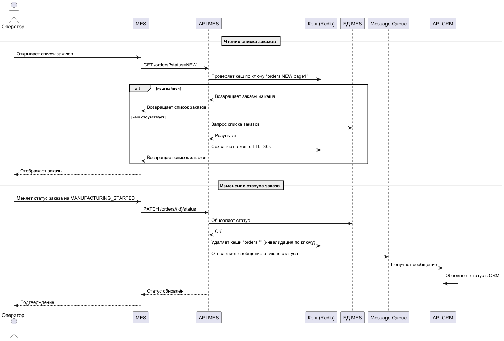

### **Мотивация**
**Проблемы, которые решает кеширование:**
1. **Медленная загрузка списка заказов в MES** — операторы не могут быстро видеть новые заказы, что влияет на их оплату.
2. **Высокая нагрузка на базу данных MES** из-за частых запросов списка заказов (особенно с фильтрами и пагинацией).
3. **Рост числа запросов через API MES** от внешних продавцов, что увеличивает нагрузку на расчёт стоимости и получение статусов.
4. **Задержки в работе CRM и MES** из-за синхронных запросов к БД при каждом обновлении статуса.

**Что планируется кешировать:**
- **Списки заказов в MES** (с фильтрами по статусам и пагинацией).
- **Статусы заказов** для быстрого доступа через API.
- **Результаты расчёта стоимости** (если расчёт идёт долго, можно кешировать по хешу модели).

---

###  **Предлагаемое решение**
**Тип кеширования:** **Серверное кеширование** на уровне **API MES** и **API CRM**.  
**Почему не клиентское:**
- Данные динамические (статусы меняются часто).
- Несколько клиентов (операторы, CRM, API-пользователи) должны видеть актуальные данные.
- Необходима централизованная инвалидация.

**Паттерн кеширования:** **Cache-Aside (Lazy Loading)**  
**Почему:**
- Подходит для чтения данных, которые часто запрашиваются, но не так часто меняются (например, списки заказов).
- Позволяет избежать сложной логики записи в кеш при каждом изменении.
- Упрощает реализацию и отладку.

**Почему не Write-Through/Refresh-Ahead:**
- Write-Through усложняет логику записи и может создавать избыточную нагрузку.
- Refresh-Ahead требует предсказуемости запросов, что в нашей системе сложно реализовать.

---

### **Стратегия инвалидации кеша**
**Используем комбинированную стратегию:**
1. **Временная инвалидация (TTL)** — например, 30 секунд для списков заказов.
2. **Инвалидация по ключу при изменении данных** — при изменении статуса заказа удаляем соответствующий кеш.

**Почему именно так:**
- **Только TTL** может приводить к устаревшим данным.
- **Только инвалидация по ключу** требует отслеживания всех изменений, что сложно в распределённой системе.
- **Комбинированный подход** обеспечивает баланс между актуальностью и производительностью.

---

### **Диаграмма последовательности**

###  **Сравнительный анализ стратегий инвалидации**

| Стратегия              | Преимущества                                                                 | Недостатки                                                                 |
|------------------------|------------------------------------------------------------------------------|----------------------------------------------------------------------------|
| **TTL (временная)**    | Простота реализации, гарантированное обновление                              | Возможны устаревшие данные в период до истечения TTL                        |
| **Инвалидация по ключу** | Мгновенная актуальность данных при изменениях                              | Сложность отслеживания всех зависимых ключей в распределённой системе      |
| **Write-Through**      | Кеш всегда актуален                                                          | Усложнение логики записи, риск потери данных при сбое кеша                  |
| **Refresh-Ahead**      | Предзагрузка данных до запроса, минимальные задержки                         | Требует предсказуемости запросов, избыточная нагрузка                       |

**Вывод:** Комбинированный подход **TTL + инвалидация по ключу** даёт оптимальный баланс для нашей системы.

---

### **Итоговые рекомендации**
1. **Внедрить Redis** как кеш-слой рядом с API MES и API CRM.
2. **Кешировать:**
    - Списки заказов с фильтрами (TTL=30 сек).
    - Статусы заказов (инвалидировать при изменении).
    - Результаты расчёта стоимости (кешировать по хешу модели на 5–10 минут).
3. **Использовать паттерн Cache-Aside** для простоты и надёжности.
4. **Настроить мониторинг** попаданий в кеш через Grafana/Prometheus.

Это позволит снизить нагрузку на БД, ускорить отображение заказов и повысить отказоустойчивость системы.